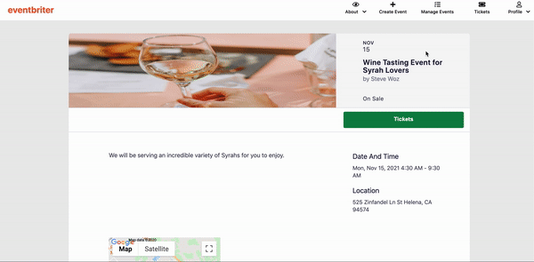

# Welcome to Eventbriter!

    

## Table of Contents

  * [About Eventbriter](#about-eventbriter)
  * [Technologies Used](#technologies-used)
  * [Features](#features)
    * [All Users](#all-users)
        * [Viewing All Events](#viewing-all-events)
        * [Viewing a Single Event](#viewing-a-single-event)
    * [Logged Out Users](#logged-out-users)
        * [User Authentication](#user-authentication)
        * [Logging In as Demo User](#logging-in-as-demo-user)
    * [Logged In Users](#logged-in-users)
        * [Creating an Event](#creating-an-event)
        * [Updating an Event](#updating-an-event)
        * [Deleting an Event](#deleting-an-event)
        * [Creating a Ticket](#creating-a-ticket)
        * [Removing a Ticket](#removing-a-ticket)
        * [Purchasing a Ticket](#purchasing-a-ticket)
        * [Requesting a Ticket Refund](#requesting-a-ticket-refund)

## About Eventbriter

Eventbriter is a full stack web application that is inspired by the Eventbrite website. When users visit the site, they are allowed to view all the events that were created by Eventbriter members. A user can become an Eventbriter member by creating an account and signing in. Once a member is signed in, they have the ability to create their own events, update their events, and delete their events. They can also create tickets so that other members can purchase tickets and attend your events. Any event that is listed as "On Sale" has tickets available to be purchased by an Eventbriter member. If a user does not want to sign up for an account, they can log in as the Demo User which will allow them to explore the same features as a logged in user.

What separates Eventbriter from Eventbrite is that it is built as a single-page web application, which provides users with a dynamic and smooth navigation across the entire site. This was made possible by utilizing React and Redux on the frontend. The backend was built on a Ruby on Rails framework, while PostgreSQL was used for database storage along with Amazon AWS S3 to store the events' images.

## Technologies Used

* Ruby on Rails
* React.js
* Redux.js
* PostgreSQL
* Webpack
* Amazon AWS S3

## Features

The following is a list of all of the features available on Eventbriter. The availability of these features will vary depending on whether a user is logged in or logged out. Some features will be available to all users of the website.

### All Users

All users of Eventbriter will be able to view a list of all events posted to the website as well as view detailed information on a single event.

#### Viewing All Events
All users have access to the website's homepage, where they can view all events that a logged in user has created. 

#### Viewing a Single Event
Clicking on one of the events listed on the website's homepage will take that user to the event's show page, where they are given details about the event.

    

### Logged Out Users

Logged out users will have access to the `Sign In` feature, which will direct them to sign up for an account, log in to their own account, or log in as the Demo User. They will also have access to the `About` feature, which is a dropdown menu that provides links to Eventbriter's GitHub Wiki page, as well as the author's LinkedIn and AngelList profile page, respectively.

#### User Authentication

User credentials are stored and accessed securely on the backend using BCrypt. When a user first signs up, their password is hashed and stored in the database as a `password_digest`. When a user logs in with their credentials, their password is hashed and compared with the `password_digest`. Upon a successful login, the user's `session_token` is set using Rails' `SecureRandom::urlsafe_base64` method, so that a user's session will persist until they decide to log out.

Frontend authentication is also provided by using Redux to store a user's session information (primary id, name, email) on the Redux store so that they can retain their session status on the client side. This session information is also used to protect certain frontend routes from being accessed. For example, if a user is logged in, they will no longer be allowed to visit the login/signup page. Conversely, non-authenticated users cannot access protected routes that are only available to authenticated users, such as the event or ticket creation pages.

#### Logging in as Demo User

A demo login is provided in the Sign In page for anyone who does not wish to sign up for an account, but would like try out the features that a logged in user is provided. In order to sign in as the Demo User, navigate to the Sign In page and click on the `Demo Log In` button:

    

### Logged In Users

Logged in users have the ability to create their own events, which can be viewed by all users of the website, update information on an event they have previously created, and delete one of their events. They also have the ability to create tickets to these events so that any Eventbriter member may purchase tickets and attend these events.

#### Creating an Event

Logged in users are able to create events that are available for all users to view and for other logged in users to attend (via purchasing tickets to the event). In order to create an event, the user must navigate to the `Create Event` icon located in the navigation bar at the very top of the page. From there, the user must provide information about the event, including the name of the event, its type and category, location, start date and time, end date and time, description, and an image. When this information is provided, the user can then click on the `Create Event` button which will create the event and guide them to create a ticket for the event. Creating a ticket for the event is not absolutely necessary for an event to exist. In this case, the status of the event will be set to "Announced" as apposed to being "On Sale" if tickets are provided. The organizer of the event can always have the option of providing tickets later, which is discussed further in [Creating a Ticket](#creating-a-ticket).

    

#### Updating an Event
If the event organizer needs to update any details about their event, they can do so by navigating to the `Manage Events` icon located in the navigation bar at the very top of the page. Clicking on this icon will take them to a list of all of their organized events. From there they can choose an event to update.

    

#### Deleting an Event
Navigating to `Manage Events` as described above, will also give the user the option of deleting one of their organized events. Doing so will also remove any tickets created for the event as well as removing any purchased tickets and refunding attendees, if tickets were purchased but the event was not attended.

#### Creating a Ticket

Any Eventbriter member that has created at least one event has the ability to create tickets for their events. To do this, the user must navigate to the `Manage Events` icon. From there, they will see a list of all of their organized events. Within the `Tickets` column for each event is the `Manage Tickets` button. Clicking on this button will take you to a list of all the tickets (if any) that have been created for the event, underneath this list will be a `Create Ticket` button that will take you to the page for creating an additional ticket. When taken to this page, the user must provide the following information for the ticket: name, quantity, price, and currency. Clicking on `Create Ticket` with all the appropriate information filled out will add this ticket to the list of tickets created for the event and will update the status of the event to "On Sale". If there are tickets available, but none of them have a price above 0, then the status of the event will be updated to "Free".

    

#### Removing a Ticket

Going through the same process as above with navigating to `Manage Tickets` will also provide the option to remove a ticket from the current logged in user's organized events. As described above, `Manage Tickets` lists all of the tickets available for the user's organized event. This list provides a brief description of each ticket, including the ticket's name, number of tickets sold, the total ticket quantity, and the ticket price. The last column `Manage Ticket` provides a dropdown menu with options to either update a ticket's information or remove the ticket. Clicking on `Remove Ticket` will remove the ticket from the list of available tickets for the event. It will also remove any `purchased tickets` from users that have bought tickets to the event and will notify the event organizer that all event attendees have been refunded. Removing all tickets to an event will update the status of that event back to  "Announced".

#### Purchasing a Ticket

Any event that is listed as "On Sale" has tickets that are available for any Eventbriter member to purchase. Any user can view a list of all available events, but when a logged in user clicks on an event that is listed as "On Sale", they are provided a `Tickets` button that will give them the ability to purchase available tickets to this event. Clicking on the `Tickets` button will cause a modal to pop up which will list all the available tickets. Next to each ticket is a dropdown option where a user can purchase up to ten tickets at a time, if ten are available. Once the user chooses at least one ticket to purchase, the `Purchase Tickets` button becomes active and the user can click on this button to purchase their tickets. Once they click on the button, they will be shown a receipt of all the tickets they have purchased, as well as the total price of each ticket type and the total price all together. A logged in user can view a list of all of their purchased tickets by navigating to the `Tickets` icon located in the navigation bar at the top of the page. This list provides information for each ticket purchase, including the name of the event, the ticket name, the quantity purchased, and the ticket price for a single ticket. The last column provides an option to request a ticket refund, which is discussed [below](#requesting-a-ticket-refund).

    

#### Requesting a Ticket Refund
When a logged in user navigates to the `Tickets` icon, located in the navigation bar at the very top of the page, they will be taken to a list of all the tickets they have purchased. At the very right of each ticket listed is a button that says `Request Refund`. Clicking on this button will remove the purchased ticket from your list and notify you that you have been refunded.

    

